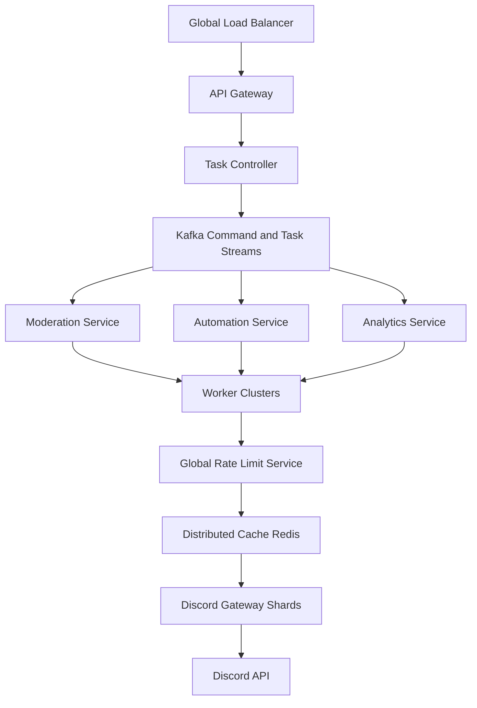

# Architecture

## High-level system

## Request flow

1. `api-gateway` accepts signed commands from operators or internal clients.
2. `task-controller` validates the command and expands it into idempotent tasks.
3. `queue-service` publishes commands and tasks to Kafka, partitioned by `guild_id`.
4. Domain workers consume tasks, check the rate-limit state, and execute the action.
5. `cache-service` serves shared guild, channel, and profile cache reads for hot paths.
6. `metrics-service` exposes Prometheus metrics and queue health views.
7. `shard-manager` owns gateway connectivity and emits platform events.

## Service boundaries

- `api-gateway`: request authentication, validation, policy hooks, ingress metrics
- `task-controller`: command fan-out, task planning, deduplication, retry budgeting
- `queue-service`: Kafka publishing, consumer group conventions, dead-letter routing
- `cache-service`: Redis-backed cache lookup API and shared key conventions
- `metrics-service`: Prometheus exposition, queue lag summaries, worker fleet visibility
- `worker`: execution, route-bucket pacing, dead-letter escalation, outcome emission
- `rate-limit-service`: shared rate-limit key construction and coordination APIs
- `audit-service`: audit intake, operator traceability, compliance export hooks
- `shard-manager`: shard lifecycle, session resume, event forwarding

## Data ownership

- Kafka: streaming backbone for commands, tasks, events, metrics, dead letters
- Redis: hot cache, route buckets, short-lived leases, shard coordination markers
- Postgres: source of truth for tasks, approvals, command state, and audit history

## Scaling notes

- Partition Kafka by `guild_id` to preserve ordering for bulk moderation tasks.
- Scale workers on queue lag, task latency, and route-limit pressure rather than CPU alone.
- Keep gateway shards region-aware but enforce single execution ownership per guild.
- Acknowledge tasks only after result persistence and audit emission.

## Multi-region recommendation

- Keep control APIs globally reachable.
- Keep command execution single-writer per guild.
- Fail over regions intentionally; do not run active-active execution for the same guild.
